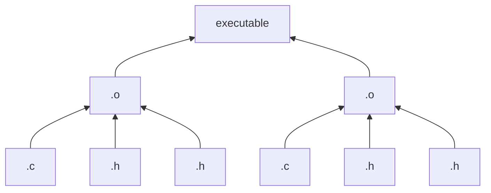
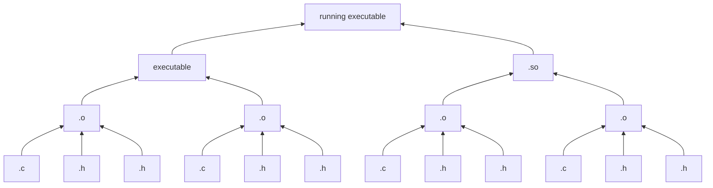
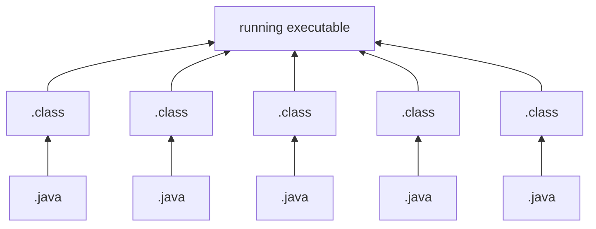
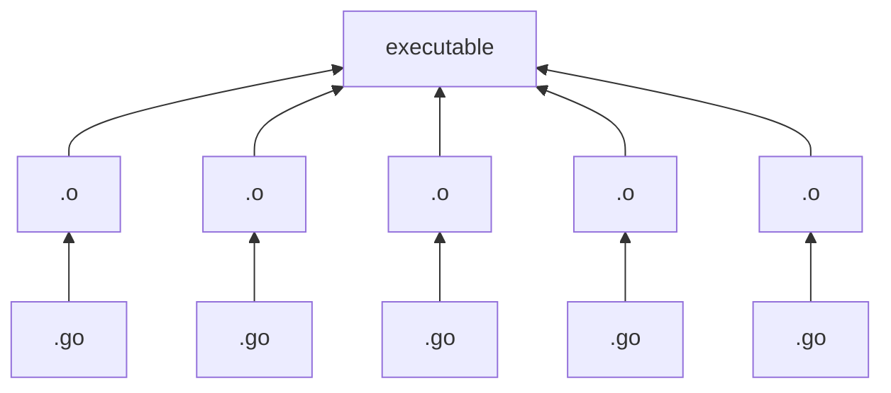
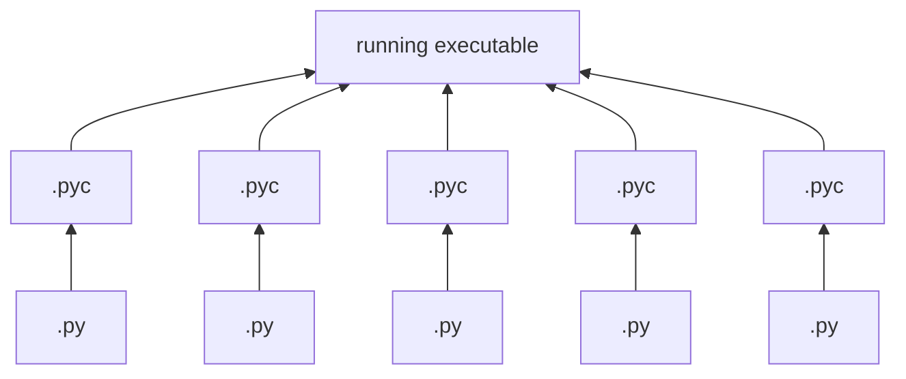

+++
title = "Artifact Dependency Graph"
toc=true
aliases = [ "artifact_tree" ]
+++

## Artifact Dependency Graph

The Artifact Dependency Graph (ADG) of an [artifact](/glossary/artifact) is the recursive DAG (Directed Acyclic Graph) of all the `input artifacts` that are transformed by a [build tool](/glossary/build_tool) into
that artifact.  It includes the direct input artifacts, and the recursive set of artifacts to each input artifact, all the way down to source code.

### C Examples
#### Simple C Executable

#### Running C Executable with Shared Object

### Java Example

### Go Example

### Python Example

## Artifact Dependency Graph singularity

An artifact should have precisely one Artifact Dependency Graph. All [equivalent artifacts](/glossary/artifact/#artifact-equivalency) should have the same Artifact Dependency Graph.

## Recommended Additional Reading

- Find out how [OmniBOR](/glossary/omnibor) represents Artifact Dependency.
