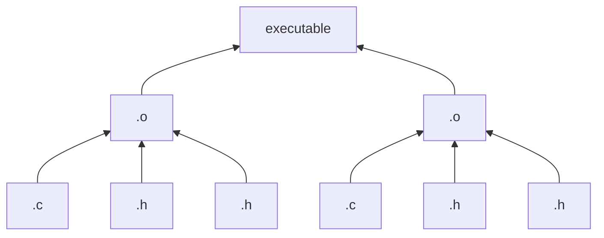
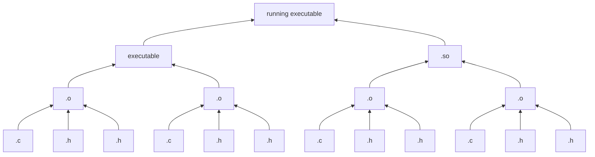
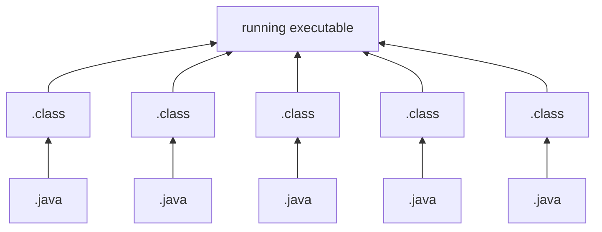
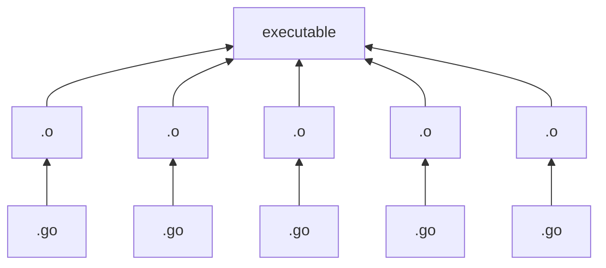
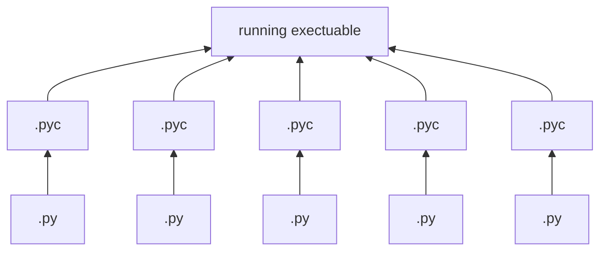
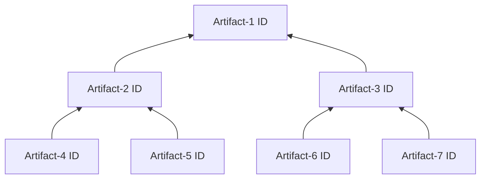
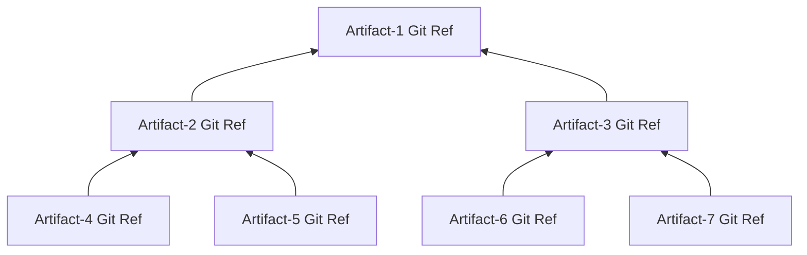

+++
title = "Artifact Tree"
toc=true
+++

## Artifact Tree

The artifact tree of an [artifact](/glossary/artifact) is the recursive DAG (Directed Acyclic Graph) of all the `input artifacts` that are transformed by a [build tool](/glossary/build_tool) into
that artifact.  It includes the direct input artifacts, and the recursive set of artifacts to each input artifact, all the way down the tree.

### C Examples
#### Simple C Executable


#### Running C Executable with Shared Object


### Java Example


### Go Example


### Python Example


## Representation

The artifact tree can be represented as a tree with the nodes identified by an [artifact id](/glossary/artifact#artifact-identifiers).



GitBOM advocates for using the [Git Ref](/glossary/git/#git-ref) of an artifact as its [artifact id](/glossary/artifact#artifact-identifiers):



### GitBOM Document
The parent-child relationship is captured by a set of GitBOM Documents.

Each artifact has a GitBOM document that describes its immediate children consiting of a set of new line delimited records, one for each child, in lexical order.

A child artifact which is itself a [leaf artifacts](/glossary/artifact/#leaf-artifacts) would be represented by

```
blob⎵${git ref of child}\n
```

A child artifact which is itself a [derived artifact](/glossary/artifact/#derived-artifacts) would be represented by
```
blob⎵${git ref of child}⎵bom⎵${gitref of child's GitBOM document}\n
```

Example:


Artifact-2's GitBOM:

```
blob⎵${git ref of Artifact-4}\n
blob⎵${git ref of Artifact-5}\n
```

Artifact-3's GitBOM:
```
blob⎵${git ref of Artifact-6}\n
blob⎵${git ref of Artifact-7}\n
```

Artifact-1's GitBOM:
```
blob⎵${git ref of Artifact-2}⎵bom⎵${git ref of Artifact-2's GitBOM}\n
blob⎵${git ref of Artifact-3}⎵bom⎵${git ref of Artifact-2's GitBOM}\n
```

## Recommended Additional Reading
- Find out how [GitBOM](/glossary/gitbom) represents artifact trees.