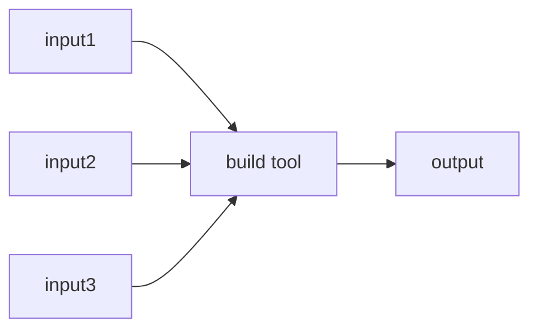
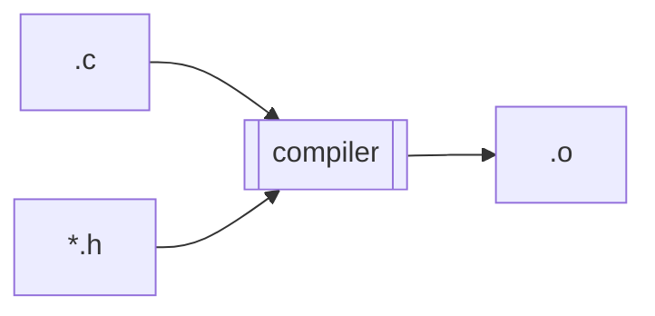
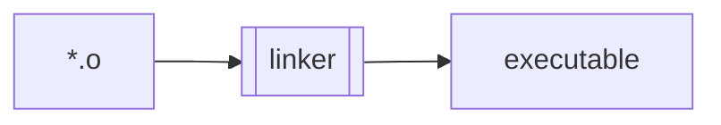
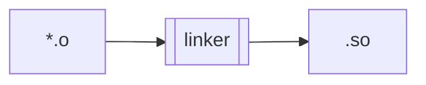
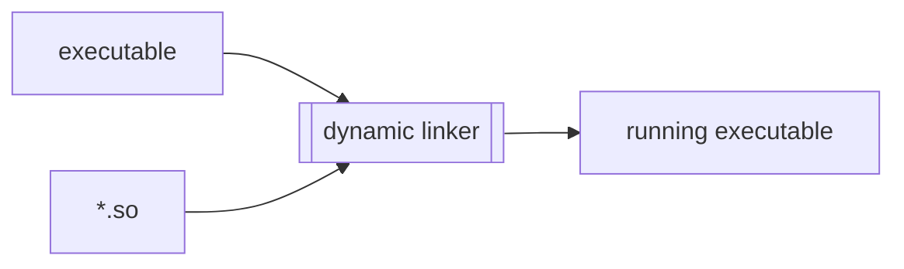
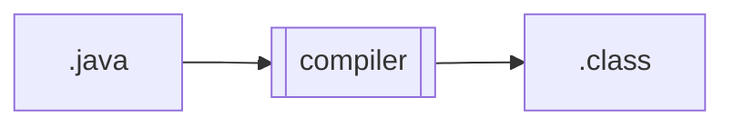
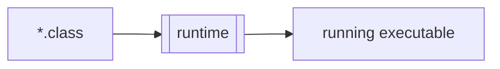
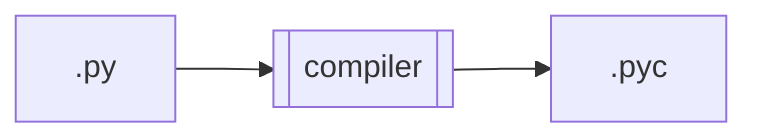
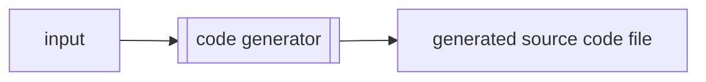

+++
title = "Build Tool"
toc=true
+++

# Build Tools

A build tool is something which reads one or more input [artifacts](/glossary/artifact) and writes one or more output [artifacts](/glossary/artifact).

Examples:
* C compiler consumes one .c file and zero or more .h files to produce a .o file

* C linker consumes one or more .o files to produce an executable file

* C linker consumes one or more .o files to produce a shared object

* Dynamic linker consumes an executable file and zero or more shared objects to produce a running process

* Java compiler consumes a .java file to produce a .class files

* Java runtime consumes one or more .class files to produce a running process

* Python bytecode compiler consumes a .py file to produce a .pyc file

The totality of ancestors for a given artifact may be represented as an [Artifact Dependency Graph (ADG)](/glossary/artifact_dependency_graph).

## Code Generators

Typically, source code files are hand written by humans, and as such are [leaf artifacts](/glossary/artifact/#leaf-artifacts) in the [Artifact Dependency Graph (ADG)](/glossary/artifact_dependency_graph).

Source code files can also be **generated** from other inputs by a code generator.

In this scenario, the generated source code file is a [derived artifact](/glossary/artifact/#derived-artifacts). This is because the [code generator](build_tool/#code-generators) is a [build tool](#build-tools) and, by definition, the output from the [build tool](#build-tools) is a [derived artifact](/glossary/artifact/#derived-artifacts).

Code generation is very common in many languages.  See [go generate](https://eli.thegreenplace.net/2021/a-comprehensive-guide-to-go-generate/), [Java Xtend](https://www.eclipse.org/xtend/), and [qtcpp](https://qface.readthedocs.io/en/latest/qtcpp.html).

