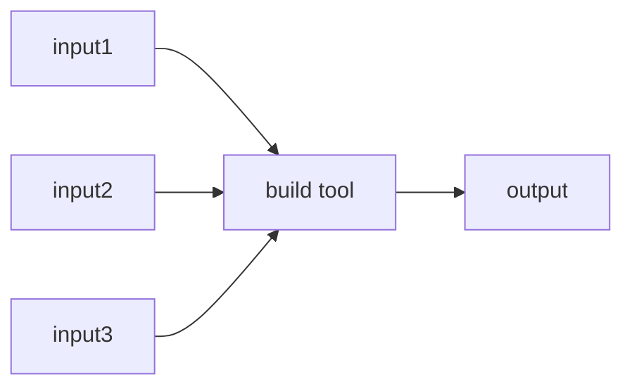
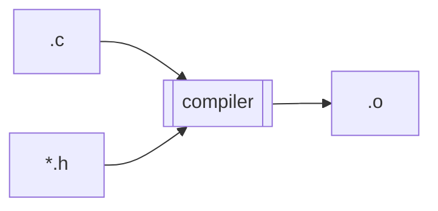
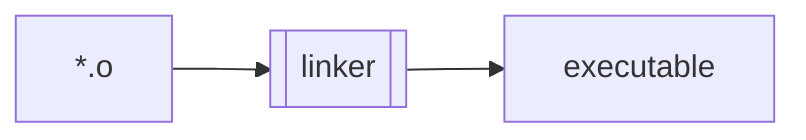
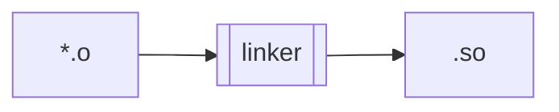
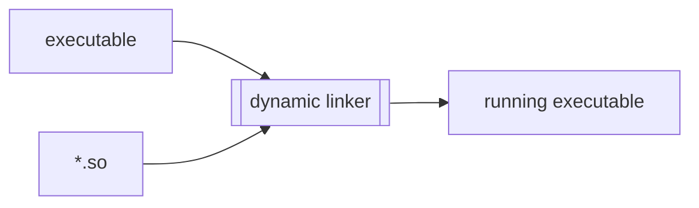
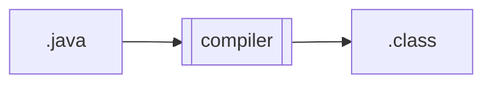
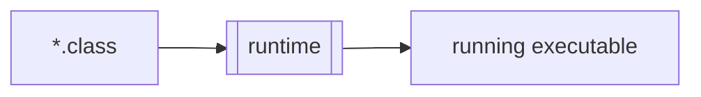
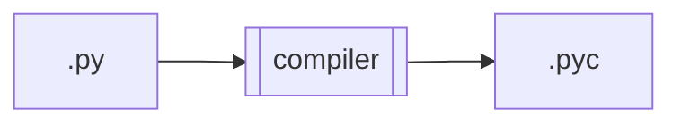
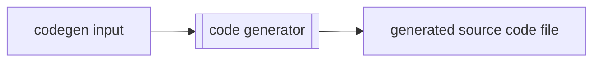

+++
title = "Build Tool"
toc=true
+++

# Build Tools

A build tool is something which reads one or more input [artifacts](/glossary/artifact) and writes one or more output [artifacts](/glossary/artifact).

Examples:
* C compiler consumes one .c file and zero or more .h files to prodce a .o file

* C linker consumes one or more .o files to produce an executable file

* C linker consumes one or more .o files to produce a shared object

* Dynamic linker consumes an executable file and zero or more shared objects to produce a running process

* Java compiler consumes a .java file to produce a .class files

* Java runtime consumes one or more .class files to produce a running process

* Python bytecode compiler consumes a .py file to produce a .pyc file

The totality of ancestors for a given artifact may be represented as an [artifact tree](/glossary/artifact_tree).

## Code Generators

Typically, source code files are hand written by humans, and as such are [leaf artifacts](http://localhost:1313/glossary/artifact/#leaf-artifacts) in the [artifact tree](/glossary/artifact_tree).

Sometimes source code files are themselves **generated** by a code generator from inputs.

A code generator is a [build tool](#build-tools).  The output from a [build tool](#build-tools) is a [derived artifact](http://localhost:1313/glossary/artifact/#derived-artifacts).  Therefore generated soure code is a [derived artifact](http://localhost:1313/glossary/artifact/#derived-artifacts).

