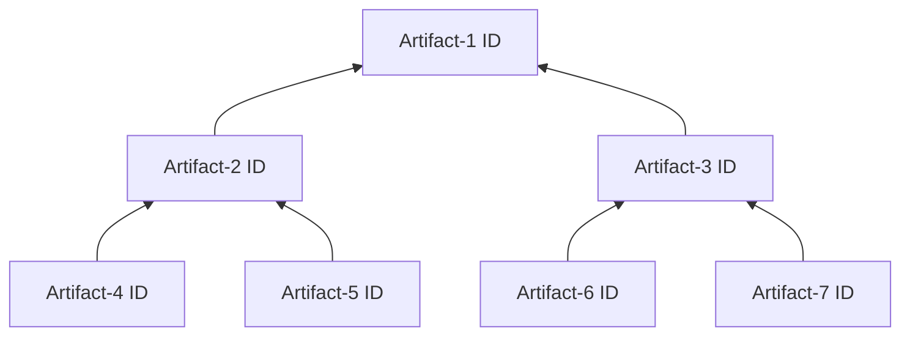
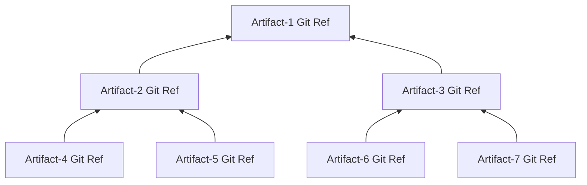

+++
title = "GitBOM"
toc=true
+++

An [artifact tree](/glossary/artifact_tree) can be represented as a tree with the nodes identified by an [artifact id](/glossary/artifact#artifact-identifiers).



GitBOM advocates for using the [Git Ref](/glossary/git/#git-ref) of an artifact as its [artifact id](/glossary/artifact#artifact-identifiers):



## GitBOM Document
The parent-child relationship is captured by a set of GitBOM Documents.

Each artifact has a GitBOM document that describes its immediate children consiting of a set of new line delimited records, one for each child, in lexical order.

A child artifact which is itself a [leaf artifacts](/glossary/artifact/#leaf-artifacts) would be represented by

```
blob⎵${git ref of child}\n
```

A child artifact which is itself a [derived artifact](/glossary/artifact/#derived-artifacts) would be represented by
```
blob⎵${git ref of child}⎵bom⎵${gitref of child's GitBOM document}\n
```

Example:


Artifact-2's GitBOM:

```
blob⎵${git ref of Artifact-4}\n
blob⎵${git ref of Artifact-5}\n
```

Artifact-3's GitBOM:
```
blob⎵${git ref of Artifact-6}\n
blob⎵${git ref of Artifact-7}\n
```

Artifact-1's GitBOM:
```
blob⎵${git ref of Artifact-2}⎵bom⎵${git ref of Artifact-2's GitBOM}\n
blob⎵${git ref of Artifact-3}⎵bom⎵${git ref of Artifact-2's GitBOM}\n
```

## GitBOM Identifier

For a given artifact, the GitBOM ID of that artifact is simply the git ref of its corresponding GitBOM Document.

## GitBOM Identifier Embedding

GitBOM advocates for [build tools](/resources/glossarybuildtool) to embed into each [derived artifact](/glossary/artifact/#derived-artifacts) they are building that derived artifact's GitBOM ID.

Examples:

**ELF Files (Executables and .so, and .o files)**
: Embed GitBOM identifier into an elf section named ‘.bom’

**ar Files (.a static libraries)**
: Embed GitBOM identifier into an archive entry named ‘.bom’

**General Archive files (tar,gzip,etc)**
: Embed GitBOM identifier into an archive entry named ‘.bom’

**Java class file**
: Embed GitBOM identifier into an annotation named @BOM in the .class file.

**Python .pyc files**
: Embed GitBOM identifier into an __bom__ in the .pyc file.

**Container Images**
: Embed GitBOM identifier into the image manifest as an annotation named “dot.bom”

## GitBOM Complements SBOM
GitBOM can help [SBOMs](/glossary/sbom) be more precise and reliable.