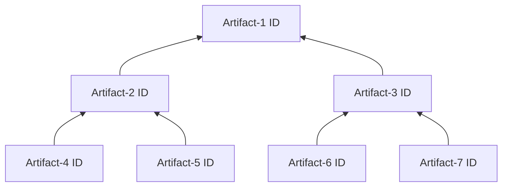
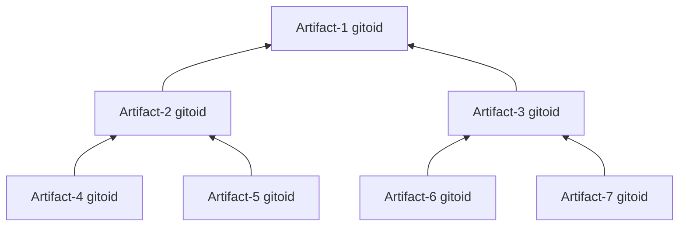

+++
title = "OmniBOR"
toc=true
aliases = [
    "/glossary/gitbom",
]
+++

An [artifact tree](/glossary/artifact_tree) can be represented as a tree with the nodes identified by an [artifact id](/glossary/artifact#artifact-identifiers).



OmniBOR advocates for using the [gitoid](/glossary/git/#git-object-id-gitoid) of an artifact as its [artifact id](/glossary/artifact#artifact-identifiers):



## OmniBOR Document
The parent-child relationship is captured by a set of OmniBOR Documents.

Each artifact has a OmniBOR document that describes its immediate children consiting of a set of new line delimited records, one for each child, in lexical order.

A child artifact which is itself a [leaf artifacts](/glossary/artifact/#leaf-artifacts) would be represented by

```
blob⎵${gitoid of child}\n
```

A child artifact which is itself a [derived artifact](/glossary/artifact/#derived-artifacts) would be represented by
```
blob⎵${gitoid of child}⎵bom⎵${gitoid of child's OmniBOR document}\n
```

Example:


Artifact-2's OmniBOR:

```
blob⎵${gitoid of Artifact-4}\n
blob⎵${gitoid of Artifact-5}\n
```

Artifact-3's OmniBOR:
```
blob⎵${gitoid of Artifact-6}\n
blob⎵${gitoid of Artifact-7}\n
```

Artifact-1's OmniBOR:
```
blob⎵${gitoid of Artifact-2}⎵bom⎵${gitoid of Artifact-2's OmniBOR}\n
blob⎵${gitoid of Artifact-3}⎵bom⎵${gitoid of Artifact-2's OmniBOR}\n
```

## OmniBOR Identifier

For a given artifact, the OmniBOR ID of that artifact is simply the gitoid of its corresponding OmniBOR Document.

## OmniBOR Identifier Embedding

OmniBOR advocates for [build tools](/resources/glossarybuildtool) to embed into each [derived artifact](/glossary/artifact/#derived-artifacts) they are building that derived artifact's OmniBOR ID.

Examples:

**ELF Files (Executables and .so, and .o files)**
: Embed OmniBOR identifier into an elf section named ‘.bom’

**ar Files (.a static libraries)**
: Embed OmniBOR identifier into an archive entry named ‘.bom’

**General Archive files (tar,gzip,etc)**
: Embed OmniBOR identifier into an archive entry named ‘.bom’

**Java class file**
: Embed OmniBOR identifier into an annotation named @BOM in the .class file.

**Python .pyc files**
: Embed OmniBOR identifier into an __bom__ in the .pyc file.

**Container Images**
: Embed OmniBOR identifier into the image manifest as an annotation named “dot.bom”

**Generated Source Code**
: Embed OmniBOR identifier for a generated source code file using a comment

## OmniBOR Compliments SBOM
OmniBOR can help [SBOMs](/glossary/sbom) be more precise and reliable.

See [SBOM: OmniBOR Compliments SBOMs](/glossary/sbom/#omnibor-compliments-sbom) for further details.
