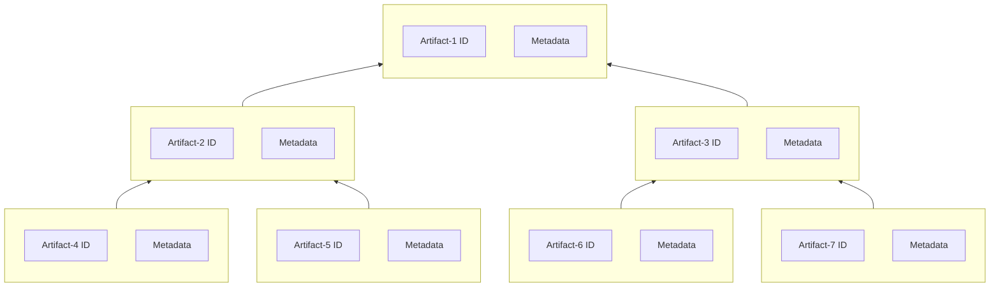

+++
title = "SBOM"
toc = "true"
+++

## SBOMs
GitBOM is not an SBOM. It is designed to complement SBOMs, such as [SPDX](https://spdx.dev/), [CycloneDX](https://cyclonedx.org/), or [SWID](https://nvd.nist.gov/products/swid).

SBOMs tend to be defined as dependency graphs of ([artifact id](/glossary/artifact#artifact-identifiers),[metadata](#metadata)) tuples for a wide variety of metadata.



## Metadata

Metadata is information *about* the artifact identified by the [artifact id](/glossary/artifact#artifact-identifiers).

Examples include but are not limited to:

- vendor
- release version
- contact information
- license
- copyright

## GitBOM Compliments SBOM
[GitBOM](/glossary/gitbom/) can help [SBOMs](/glossary/sbom) be more precise and reliable.

Most [SBOMs](/glossary/sbom) allow for 'external identifiers' and can thus use [gitoid](/glossary/git/#git-object-id-gitoid) to reference the artifacts in the GitBOM [Artifact Dependency Graph (ADG)](/glossary/artifact_dependency_graph). This allows an [SBOM](/glossary/sbom) describing a specific component, e.g. `Component Name: Django` and `Component Version: 1.11.1`, to reference a list of applicable [GitBOM IDs](/glossary/gitbom/#gitbom-identifier).

This is helpful because today two different tools might produce two different SBOMs for the same software [artifact](/glossary/artifact/). This could occur if the SBOM generation tools use different sources to identify and describe the component. GitBOM provides a precise software [artifact identifier](/glossary/artifact/#artifact-identifiers) which can be used in SBOMs in situations where naming schemes may be ambiguous.

**Example 1**: If one SBOM generation tool uses [CPEs](https://nvd.nist.gov/products/cpe):
```
cpe:2.3:a:djangoproject:django:1.11.1:*:*:*:*:*:*:*
```
and the other uses [PURL](https://github.com/package-url/purl-spec):
 ```
 pkg:pypi/django@1.11.1
 ```
 ...then these two SBOMs might diverge when they define the component supplier: it could be `Component Supplier: djangoproject` or `Component Supplier: pypi`.

 **Example 2:** In another instance a vendor might choose to use their product's current marketing name for the component name in their SBOM generation tools, whereas third-party SBOM generation tools might use the vendor's product name as listed in a [CPE](https://nvd.nist.gov/products/cpe) or [SWID tag](https://nvd.nist.gov/products/swid).

 By enabling both SBOM generation tools to list the GitBOM ID(s) for specifically applicable [Artifact Dependency Graph(s) (ADG(s))](/glossary/artifact_dependency_graph) associated with the component, an SBOM consumer can quickly understand that both SBOMs do describe the same artifact, regardless of ambiguities in naming schemes.
