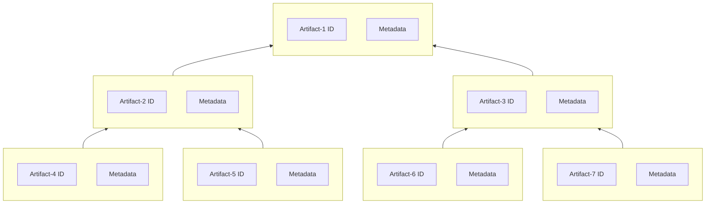

+++
title = "SBOM"
toc = "true"
+++

## SBOMs
GitBOM is not an SBOM. It is designed to complement SBOMs, such as [SPDX](https://spdx.dev/), [CycloneDX](https://cyclonedx.org/), or [SWID](https://nvd.nist.gov/products/swid).

SBOMs tend to be defined as trees of ([artifact id](/glossary/artifact#artifact-identifiers),[metadata](#metadata)) tuples for a wide variety of metadata.

## Metadata

Metadata is information *about* the artifact identified by the [artifact id](/glossary/artifact#artifact-identifiers).

Examples include but are not limited to:

- vendor
- release version
- contact information
- license
- copyright

## GitBOM Complements SBOM

Most SBOMs allow for 'external identifiers' and can thus use git refs to reference the artifacts in the GitBOM [artifact trees](/glossary/artifact_tree).

[GitBOM](/glossary/gitbom) helps improve SBOMs, it does not seek to *be* an SBOM.
